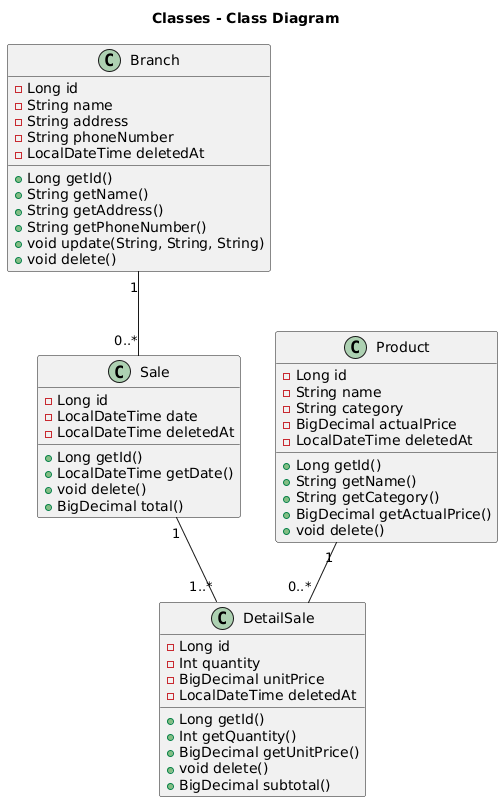
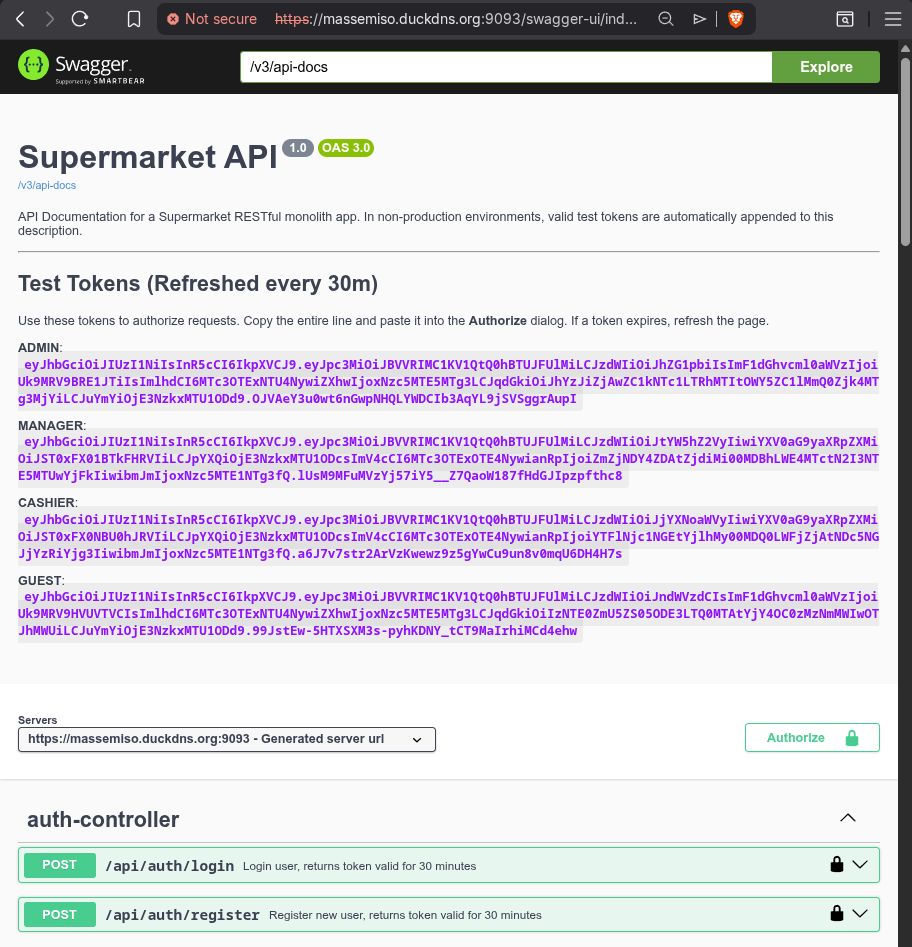

# Supermarket Management API
A REST API built with Spring Boot to manage supermarkets branches, products
and sales. This project was developed inspired by a technical test to
demonstrate skills in Java and Spring Boot.

## Features
- Role-based security using **Spring Security** and **JWT (JSON Web Tokens)**. Secures endpoints based on `ADMIN`, `MANAGER`, `CASHIER`, and `GUEST` roles.
- **Authentication System**: Login and Registration endpoints providing stateless JWT authentication.
- **CRUD** operations for Users, Branches, Products and Sales.
- **Business Statistics** for best-selling products via native SQL projections.
- **Soft deletion** of entities: to preserve data integrity and allow for data recovery.
- Pagination and search sorting for collections.
- Consistent API responses with **JSON**, including exception details.
- **Optimistic Locking** using JPA @Version to prevent data overwriting in high-load scenarios.
- Logging with **SLF4J** and **Logback**, including **Aspect-Oriented Logging (AOP)** for service monitoring.
- **Nginx** implementation for **SSL Termination (HTTPS)** and secure request routing.
- **Dockerized Architecture** using **Docker Compose**, featuring persistent volumes for PostgreSQL data and service logs.
- **Automated auditing** using **Spring Data JPA Auditing**.

## Domain Model
Below is the class diagram representing the core entities and their relationships.



## Stack
- Java 21+
- Maven
- Spring Boot 3.x
- Spring Security & JWT
- Spring Boot JPA (Hibernate)
- PostgreSQL (production/docker) 
- H2 (local development/in-memory)
- Testcontainers
- REST Assured
- Docker & Docker Compose
- Lombok & DTO Mapping using MapStruct

## Project Structure
~~~
/
├── docker/        # Infrastructure config (Nginx, Certs, Logs)
├── src/main/java/com/massemiso/supermarket_api/
│   ├── aspect/    # Aspect-Oriented Programming (Logging)
│   ├── config/    # JPA Auditing, Web, Security & JWT filters
│   ├── controller/# REST Endpoints with @Valid and @PreAuthorize
│   ├── dto/       # Records for immutable data transfer 
│   ├── entity/    # JPA Models with @MappedSuperclass for Soft Delete
│   ├── exception/ # Custom exceptions & @ControllerAdvice handler
│   ├── mapper/    # Mapper Classes with MapStruct
│   ├── repository/# Data Access Layer (Native Queries & Projections)
│   ├── service/   # Business Logic with @Transactional boundaries
│   ├── util/      # JWT and Security utilities
│   └── SupermarketApplication.java # Main application class
~~~

## Testing Strategy
This project follows a testing pyramid:
- **Unit Tests**: Using JUnit 5 and Mockito to test service logic and mappers in isolation. 
- **Integration Tests**: Using Testcontainers to spin up a real PostgreSQL 15 container, ensuring the repository layer and native SQL queries behave exactly as they would in production. 
- **API Tests**: Using **REST Assured** to validate HTTP status codes, JSON paths, and business constraints. 
- **Coverage**: Instrumented with **JaCoCo** to ensure high code 
  reliability (DTOs and Configs excluded for meaningful metrics).

## Live Demo (Try it out!)
 **NOTE:** This is a live instance of the application running on a home server.
 - **URL:** [https://massemiso.duckdns.org:9093/swagger-ui/index.html](https://massemiso.duckdns.org:9093/swagger-ui/index.html)
 - **SSL Warning:** A *"Connection not private"* warning is **expected** due to a self-signed certificate. Click **"Advanced"** → **"Proceed"**.
 - **HTTPS Only:** For security reasons, only HTTPS is available on port `9093`.
 - **Patience Required:** Hosted on a home connection; latency may be higher than cloud hosting.
 - **Seeding:** Running in `default` mode. Use the pre-seeded users from the [API Documentation](#api-documentation) section.
 - **Easy Testing:** For your convenience, **valid JWT test tokens** for all roles are automatically generated and displayed at the top of the Swagger UI description. Simply copy and paste them into the "Authorize" button!



## Getting Started

### Prerequisites
- JDK 21
- Docker & Docker Compose
- OpenSSL (Required for local HTTPS/Nginx setup)

### Installation & Deployment

1. **Clone the repository**
   ```bash
   git clone https://github.com/massemiso/supermarket-api.git
   cd supermarket-api
   ```

2. **Setup Infrastructure (Docker Only)**
   <br>If you are deploying via Docker, you must generate local SSL certificates for the Nginx proxy:
   ```bash
   mkdir -p docker/certs
   openssl req -x509 -nodes -days 365 -newkey rsa:2048 \
     -keyout docker/certs/selfsigned.key \
     -out docker/certs/selfsigned.crt \
     -subj "/C=US/ST=State/L=City/O=Organization/CN=localhost"
   ```

3. **Configure Environment Variables (Optional)**
   <br>The application uses environment variables for security. While recommended for production, you can skip this step for local development. If you choose to configure them, create a `.env` file in the root directory:
   ```bash
   cp .env.example .env
   ```
   If this file is not created, Docker Compose and the application will automatically fall back to the sensible default values defined in the configuration files.

4. **Build and Run**
   ```bash
   ./mvnw clean package -DskipTests
   docker compose up --build -d
   ```
   _This starts the Spring Boot app, a persistent PostgreSQL container, and an Nginx reverse proxy. All traffic is served over HTTPS._
5. **Watch the logs (Extra)**
   ```bash
   docker compose logs -f
   ```

## Execution Modes

The application behavior changes significantly based on the `SPRING_PROFILES_ACTIVE` variable in your `.env`.

###  Development & Demo (Default)
**Best for:** Exploring features, running automated tests, or quick demos.
- **How-To:** Set `SPRING_PROFILES_ACTIVE=default` in `.env` or just don't create a `.env` file.
- **Database:** Uses H2 in-memory (or PostgreSQL if Docker is up).
- **Seeding:** Automatically populates the DB with mock branches, products, and sales.
- **Pre-seeded Users:**
    - `admin`, `manager`, `cashier`, `guest` (Passwords: `see below on API Documentation`).
- **Access:** Test all permission levels immediately via Swagger at `https://localhost/swagger-ui/index.html`.

### Production (Secure)
**Best for:** Real-world deployment or a clean "production-like" test.
- **How-To:** Set `SPRING_PROFILES_ACTIVE=prod` in `.env`.
- **Database:** Connects to PostgreSQL.
- **Seeding:** No mock data is generated.
- **Security:** **Only one** admin user is created using the `PROD_ADMIN_USERNAME/PASSWORD` from your `.env`.
- **Note:** You must manually set up your branches and products after logging in as the Admin.

## Monitoring & Logs
The project is configured to persist logs from all services directly to your host machine:

- **Spring API:** `docker/logs/app/spring.log`
- **PostgreSQL:** `docker/logs/db/postgresql-*.log`
- **Nginx Proxy:** `docker/logs/nginx/access.log` & `error.log`

*Note: Database logs are automatically managed via a self-fixing permission entrypoint to ensure they are readable on your host.*

## API Documentation

### Authentication & Security
The API is secured using **JWT (JSON Web Tokens)**. To access protected endpoints, you must include the token in the `Authorization` header as a `Bearer` token.

**Pre-seeded Users (Development Mode Only):**

| Username | Password | Role |
| :--- | :--- | :--- |
| `admin` | `admin123` | ADMIN |
| `manager` | `manager123` | MANAGER |
| `cashier` | `cashier123` | CASHIER |
| `guest` | `guest123` | GUEST |

*Note: In production mode, use the credentials defined in your `.env` file.*

| Method | Endpoint | Description | Roles Required | Request Body | Return | Common Errors                                            |
| :--- | :--- |:--- |:---------------|:------------|:------------|:---------------------------------------------------------|
| POST | `/api/auth/login` | Authenticate and get a JWT token | `NONE` | `username`, `password` | OK 200 | 401 (Bad Credentials), 400 (Validation), 404 (Not Found) |
| POST | `/api/auth/register` | Register a new user as `GUEST` | `NONE` | `username`, `password`, `email` | CREATED 201 | 400 (Validation), 409 (User Exists)                      |

#### Example JSON Requests/Responses
- POST Login Request:
~~~json
{
  "username": "admin",
  "password": "admin123"
}
~~~
- POST Login Success Response:
~~~json
{
  "content": {
    "username": "admin",
    "token": "eyJhbGciOiJIUzI1NiIsInR5cCI6IkpXVCJ9...",
    "status": true
  },
  "timestamp": "2026-05-12 22:30:00",
  "message": "Login successful",
  "status": 200
}
~~~
- POST Login Failure Response (Wrong Password):
~~~json
{
  "content": null,
  "timestamp": "2026-05-12 22:31:00",
  "message": "Bad credentials",
  "status": 401
}
~~~


### Users
| Method | Endpoint | Description | Roles Required | Request Body | Return | Common Errors |
| :--- | :--- |:--- |:---------------|:------------|:------------|:------------|
| GET | `/api/users` | Fetches all users (supports pagination) | `ADMIN`,`MANAGER` | `NONE` | OK 200 | `NONE` |
| GET | `/api/users/{id}` | Gets details of a specific user | `ADMIN`,`MANAGER` | `NONE` | OK 200 | 404 (Not Found) |
| POST | `/api/users` | Register a new user with roles | `ADMIN`,`MANAGER` | `username`, `password`, `email`, `roles` | CREATED 201 | 400 (Validation), 409 (Conflict) |
| PUT | `/api/users/{id}` | Updates a specific user | `ADMIN`,`MANAGER` | `username`, `password`, `email`, `roles` | OK 200 | 400 (Validation), 404 (Not Found) |
| DELETE | `/api/users/{id}` | **Soft deletes** a specific user | `ADMIN` | `NONE` | NO_CONTENT 204 | 404 (Not Found) |

### Branches
| Method | Endpoint | Description | Roles Required | Request Body | Return | Common Errors |
| :--- | :--- |:--- |:---------------|:------------|:------------|:------------|
| GET | `/api/branches` | Fetches all active branches (supports pagination) | `ANY`           | `NONE` | OK 200 | `NONE` |
| GET | `/api/branches/{id}` | Gets details of a specific active branch   | `ANY`           | `NONE` | OK 200 | 404 (Not Found) |
| POST | `/api/branches` | Register a new branch | `ADMIN`         | `name`, `address`, `phoneNumber` | CREATED 201 | 400 (Validation) |
| PUT | `/api/branches/{id}` | Updates a specific active branch |  `ADMIN`    | `name`, `address`, `phoneNumber` | OK 200 | 400 (Validation), 404 (Not Found) |
| DELETE | `/api/branches/{id}` | **Soft deletes** a specific active branch  |  `ADMIN`   | `NONE` | NO_CONTENT 204 | 404 (Not Found) |

### Products
| Method | Endpoint             | Description                                                                            | Roles Required    | Request Body | Return | Common Errors |
| :--- | :--- |:---------------------|:------------------|:------------|:------------|:------------|
| GET | `/api/products`      | Fetches all active products (supports pagination)                                      | `ANY`            | `NONE` | OK 200 | `NONE` |
| GET | `/api/products/{id}` | Gets details of a specific active product                                              | `ANY`            | `NONE` | OK 200 | 404 (Not Found) |
| POST | `/api/products`      | Register a new product | `ADMIN`,`MANAGER` | `name`, `category`, `actualPrice` | CREATED 201 | 400 (Validation) |
| PUT | `/api/products/{id}` | Updates a specific active product | `ADMIN`,`MANAGER` | `name`, `category`, `actualPrice` | OK 200 | 400 (Validation), 404 (Not Found) |
| DELETE | `/api/products/{id}` | **Soft deletes** a specific active product                                             | `ADMIN`,`MANAGER` | `NONE` | NO_CONTENT 204 | 404 (Not Found) |

### Sales
| Method | Endpoint          | Description                                                                                                                                        | Roles Required              | Request Body | Return | Common Errors |
| :--- | :--- |:------------------|:----------------------------|:------------|:------------|:------------|
| GET | `/api/sales`      | Fetches all active sales (supports pagination and search filtering) | `ADMIN`,`MANAGER`,`CASHIER` | `NONE` | OK 200 | `NONE` |
| GET | `/api/sales/{id}` | Gets details of a specific active sale                                                                                                             | `ADMIN`,`MANAGER`,`CASHIER` | `NONE` | OK 200 | 404 (Not Found) |
| POST | `/api/sales`      | Register a new sale | `ADMIN`,`MANAGER`,`CASHIER` | `branchId`, `detailSaleRequestDtoList` | CREATED 201 | 400 (Validation), 404 (Not Found) |
| DELETE | `/api/sales/{id}` | **Soft deletes** a specific active sale                                                                                                            | `ADMIN`,`MANAGER`          | `NONE` | NO_CONTENT 204 | 404 (Not Found) |
#### Example JSON Requests/Responses
- POST Body Request:
~~~json
{
  "branchId": 1,
  "detailSaleRequestDtoList":
  [
    {
      "quantity": 5,
      "productId": 1
    },
    {
      "quantity": 1,
      "productId": 1
    }
  ]
}
~~~
- POST Success Body Response:
~~~json
{
  "content": {
    "id": 1,
    "date": "2026-04-22",
    "branchId": 1,
    "detailSaleResponseDtoList": 
    [
      {
        "id": 1,
        "quantity": 5,
        "unitPrice": 4.50,
        "productId": 1
      },
      {
        "id": 2,
        "quantity": 1,
        "unitPrice": 4.50,
        "productId": 1
      }
    ],
    "saleStatus": "REGISTERED",
    "total": 27.0
  },
  "timestamp": "2026-04-22T12:00:00.000+00:00",
  "message": "Sale created successfully",
  "status": 201
}
~~~

### Stats
| Method | Endpoint | Description                   | Roles Required   | Return |
| :--- | :--- |:------------------------------|:-----------------| :--- |
| GET | `/api/stats/best-selling-product` | Fetches best-selling product | `ADMIN`,`MANAGER` | OK 200 |
- GET Success Body Response:
~~~json
{
  "content": {
    "product": {
      "id": 1,
      "name": "Organic Milk",
      "category": "Dairy",
      "actualPrice": 4.50
    },
    "totalRevenue": 27.0
  },
  "timestamp": "2026-04-22T12:00:00.000+00:00",
  "message": "Get best selling product successfully",
  "status": 200
  }
  ~~~